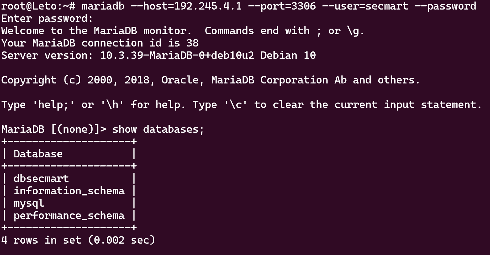
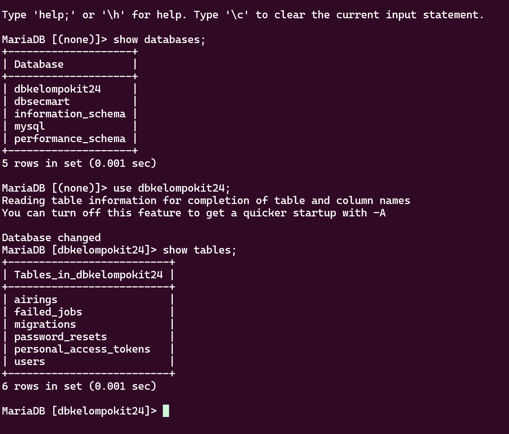
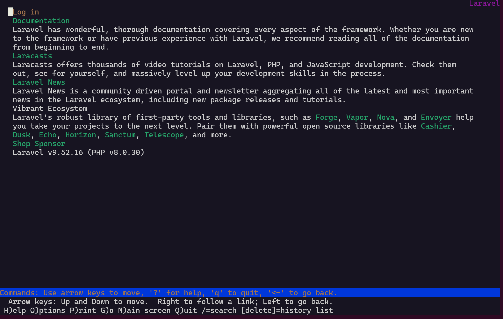
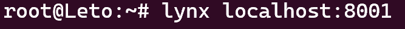
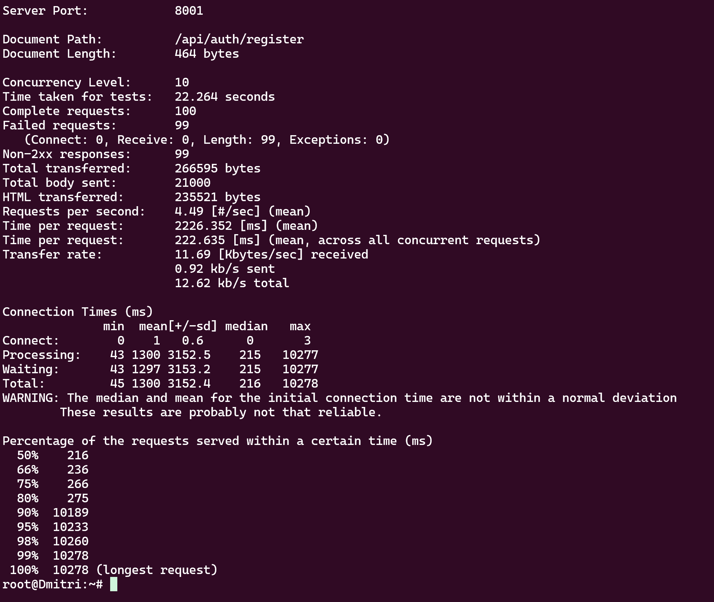

# Praktikum Modul 3
| Nama | NRP |
| --------------------- | ----------------------- |
| Monika Damelia Hutapea | 5027221011 |
| Naufan Zaki Lugmanulhakim | 5027221065 |
## Configuration
### Arakis (Router)
```
auto eth0
iface eth0 inet dhcp

auto eth1
iface eth1 inet static
	address 192.245.1.0
	netmask 255.255.255.0

auto eth2
iface eth2 inet static
	address 192.245.2.0
	netmask 255.255.255.0

auto eth3
iface eth3 inet static
	address 192.245.3.0
	netmask 255.255.255.0

auto eth4
iface eth4 inet static
	address 192.245.4.0
	netmask 255.255.255.0
```
### Mohiam (DHCP Server)
```
auto eth0
iface eth0 inet static
	address 192.245.3.2
	netmask 255.255.255.0
	gateway 192.245.3.0
```
### Irulan (DNS Server)
```
auto eth0
iface eth0 inet static
	address 192.245.4.1
	netmask 255.255.255.0
	gateway 192.245.4.0
```
### Chani (Database Server)
```
auto eth0
iface eth0 inet static
	address 192.245.4.1
	netmask 255.255.255.0
	gateway 192.245.4.0
```
### Stilgar (Load Balancer)
```
auto eth0
iface eth0 inet static
	address 192.245.4.2
	netmask 255.255.255.0
	gateway 192.245.4.0
```
### Leto (Laravel Worker)
```
auto eth0
iface eth0 inet static
	address 192.245.2.1
	netmask 255.255.255.0
	gateway 192.245.2.0
```
### Duncan (Laravel Worker)
```
auto eth0
iface eth0 inet static
	address 192.245.2.2
	netmask 255.255.255.0
	gateway 192.245.2.0
```
### Jessica (Laravel Worker)
```
auto eth0
iface eth0 inet static
	address 192.245.2.3
	netmask 255.255.255.0
	gateway 192.245.2.0
```
### Vladimir (PHP Worker)
```
auto eth0
iface eth0 inet static
	address 192.245.1.1
	netmask 255.255.255.0
	gateway 192.245.1.0
```
### Rabban (PHP Worker)
```
auto eth0
iface eth0 inet static
	address 192.245.1.2
	netmask 255.255.255.0
	gateway 192.245.1.0
```
### Feyd (PHP Worker)
```
auto eth0
iface eth0 inet static
	address 192.245.1.3
	netmask 255.255.255.0
	gateway 192.245.1.0
```
## Instalasi (`.bashrc` masing-masing node)
### Arakis (DHCP Relay)
```
apt-get update
apt-get install isc-dhcp-server
```
### Irulan (DNS Server)
```
apt-get update
apt-get install bind9 -y
```
### Mohiam (DHCP Server)
```
apt-get update
apt-get install bind9 -y
```
### Stilgar (Load Balancer)
```
apt-get update
apt-get install apache2-utils -y
apt-get install nginx -y
apt-get install lynx -y
```
### Chani (Database Server)
```
apt-get update
apt-get install mariadb-server -y
```
## Pengerjaan Soal
### Soal 1-5
`irulan.sh`
```echo 'nameserver 192.168.122.1' > /etc/resolv.conf
apt-get update
apt-get install bind9 -y

forward="options {
directory \"/var/cache/bind\";
forwarders {
           192.168.122.1;
};

allow-query{any;};
listen-on-v6 { any; };
};
"
echo "$forward" > /etc/bind/named.conf.options

echo "zone \"atreides.it24.com\" {
        type master;
        file \"/etc/bind/jarkom/atreides.it24.com\";
};

zone \"harkonen.it24.com\" {
        type master;
        file \"/etc/bind/jarkom/harkonen.it24.com\";
};
" > /etc/bind/named.conf.local

mkdir /etc/bind/jarkom

# atreides, ip leto 192.245.2.1
# harkonen, ip Vladimir 192.245.1.1
# ip stilgar  192.245.4.2

atreides="
;
;BIND data file for local loopback interface
;
\$TTL    604800
@    IN    SOA    atreides.it24.com. root.atreides.it24.com. (
        2        ; Serial
                604800        ; Refresh
                86400        ; Retry
                2419200        ; Expire
                604800 )    ; Negative Cache TTL
;
@    IN    NS    atreides.it24.com.
@       IN    A    192.245.2.1
"
echo "$atreides" > /etc/bind/jarkom/atreides.it24.com

harkonen="
;
;BIND data file for local loopback interface
;
\$TTL    604800
@    IN    SOA    harkonen.it24.com. root.harkonen.it24.com. (
        2        ; Serial
                604800        ; Refresh
                86400        ; Retry
                2419200        ; Expire
                604800 )    ; Negative Cache TTL
;
@    IN    NS    harkonen.it24.com.
@       IN    A    192.245.1.1
"
echo "$harkonen" > /etc/bind/jarkom/harkonen.it24.com

service bind9 start
```
0. `ping harkonen.it24.com` dan `ping atreides.it24.com` pada php worker
1-5. Test ping pada client


### Soal 6

`vladimir.sh`
`rabban.sh`
`feyd.sh`

```

echo nameserver 192.245.3.1 > /etc/resolv.conf
apt-get update
apt-get install nginx -y
apt-get install wget -y
apt-get install unzip -y
apt-get install lynx -y
apt-get install htop -y
apt-get install apache2-utils -y
apt-get install php7.3-fpm php7.3-common php7.3-mysql php7.3-gmp php7.3-curl php7.3-intl php7.3-mbstring php7.3-xmlrpc php7.3-gd php7.3-xml php7.3-cli php7.3-zip -y

service nginx start
service php7.3-fpm start

wget -O '/var/www/harkonen.it24.com' 'https://drive.usercontent.google.com/download?id=1lmnXJUbyx1JDt2OA5z_1dEowxozfkn30&export=download&authuser=0'
unzip -o /var/www/harkonen.it24.com -d /var/www/
rm /var/www/harkonen.it24.com
mv /var/www/modul-3 /var/www/harkonen.it24.com

cp /etc/nginx/sites-available/default /etc/nginx/sites-available/harkonen.it24.com
ln -s /etc/nginx/sites-available/harkonen.it24.com /etc/nginx/sites-enabled/
rm /etc/nginx/sites-enabled/default

echo 'server {
     listen 80;
     server_name harkonen.it24.com;

     root /var/www/harkonen.it24.com;
     index index.php index.html index.htm;

     location / {
         try_files $uri $uri/ /index.php?$query_string;
     }

     location ~ \.php$ {
         include snippets/fastcgi-php.conf;
         fastcgi_pass unix:/run/php/php7.3-fpm.sock;
         fastcgi_param SCRIPT_FILENAME $document_root$fastcgi_script_name;
         include fastcgi_params;
     }
 }' > /etc/nginx/sites-available/harkonen.it24.com

 service nginx restart

```

**Test:**
- bash
  `vladimir.sh`
  `rabban.sh`
  `feyd.sh`


- lynx localhost


### Soal 7

`irulan.sh` setting agar ip  nya menuju ke stilgar

```

echo 'nameserver 192.168.122.1' > /etc/resolv.conf
apt-get update
apt-get install bind9 -y  

echo 'zone "atreides.it24.com" {
    type master;
    file "/etc/bind/sites/atreides.it24.com";
};

zone "harkonen.it24.com" {
    type master;
    file "/etc/bind/sites/harkonen.it24.com";
};' > /etc/bind/named.conf.local


mkdir -p /etc/bind/sites
cp /etc/bind/db.local /etc/bind/sites/atreides.it24.com
cp /etc/bind/db.local /etc/bind/sites/harkonen.it24.com

echo '
;
; BIND data file for local loopback interface
;
$TTL    604800
@       IN      SOA     atreides.it24.com. root.atreides.it24.com. (
                        2023111401      ; Serial
                         604800         ; Refresh
                          86400         ; Retry
                        2419200         ; Expire
                         604800 )       ; Negative Cache TTL
;
@       IN      NS      atreides.it24.com.
@       IN      A       192.245.4.2    ; 
www     IN      CNAME   atreides.it24.com.' > /etc/bind/sites/atreides.it24.com

echo '
:
; BIND data file for local loopback interface
;
$TTL    604800
@       IN      SOA     harkonen.it24.com. root.harkonen.it24.com. (
                        2023111401      ; Serial
                         604800         ; Refresh
                          86400         ; Retry
                        2419200         ; Expire
                         604800 )       ; Negative Cache TTL
;
@       IN      NS      harkonen.it24.com.
@       IN      A       192.245.4.2     ; IP Lugner
www     IN      CNAME   harkonen.it24.com.' > /etc/bind/sites/harkonen.it24.com

echo 'options {
      directory "/var/cache/bind";

      forwarders {
              192.168.122.1;
      };

      // dnssec-validation auto;
      allow-query{any;};
      auth-nxdomain no;    # conform to RFC1035
      listen-on-v6 { any; };
}; ' > /etc/bind/named.conf.options

service bind9 start

```

`stilgar.sh`

```

echo 'nameserver 192.245.3.1' > /etc/resolv.conf
apt-get update
apt-get install apache2-utils -y
apt-get install nginx -y
apt-get install lynx -y

service nginx start

cp /etc/nginx/sites-available/default /etc/nginx/sites-available/lb_php

echo ' upstream worker {
    #    hash $request_uri consistent;
    #    least_conn;
    #    ip_hash;
    server 192.245.1.1;
    server 192.245.1.2;
    server 192.245.1.3;
}

server {
    listen 80;
    server_name harkonen.it24.com www.harkonen.it24.com;

    root /var/www/html;

    index index.html index.htm index.nginx-debian.html;

    server_name _;

    location / {
        proxy_pass http://worker;
    }
} ' > /etc/nginx/sites-available/lb_php

ln -s /etc/nginx/sites-available/lb_php /etc/nginx/sites-enabled/
rm /etc/nginx/sites-enabled/default

service nginx restart

```

`client.sh`

```

apt update
apt install lynx -y
apt install htop -y
apt install apache2-utils -y
apt-get install jq -y

```

**Test:**

- bash
  irulan.sh
  stilgar.sh
  client.sh

- ab -n 5000 -c 150 http://www.harkonen.it24.com/
  di client(paul/dmitri)


### Soal 8

**Algoriitma Round-Robin**

Pada `stilgar.sh`

```

# Round-robin
upstream worker {
    server 10.65.3.2;
    server 10.65.3.3;
    server 10.65.3.4;
}

```

Pada client (paul/dmitri)

- ab -n 500 -c 50 http://www.harkonen.it24.com/


- htop


Pada `stilgar.sh`

```

# Generic hash
upstream worker {
    hash $request_uri consistent;
    server 10.65.3.2;
    server 10.65.3.3;
    server 10.65.3.4;
}

```

Pada client (paul/dmitri)
- ab -n 500 -c 50 http://www.harkonen.it24.com/


- htop


Pada `stilgar.sh`

```

# Least connection
upstream worker {
    least_conn;
    server 10.65.3.2;
    server 10.65.3.3;
    server 10.65.3.4;
}

```

Pada client (paul/dmitri)
- ab -n 500 -c 50 http://www.harkonen.it24.com/


- htop


  
Pada `stilgar.sh`

```

# IP hash
upstream worker {
    ip_hash;
    server 10.65.3.2;
    server 10.65.3.3;
    server 10.65.3.4;
}

```

Pada client (paul/dmitri)
- ab -n 500 -c 50 http://www.harkonen.it24.com/


- htop


**Grafik**


### Soal 9

Pada `stilgar.sh`, untuk 3 worker:

```

# Least connection
upstream worker {
    least_conn;
    server 10.65.3.2;
    server 10.65.3.3;
    server 10.65.3.4;
}

```

Pada client (paul/dmitri)
- ab -n 1000-c 10 http://www.harkonen.it24.com/


- htop


Pada `stilgar.sh`, untuk 2 worker:

```

# Least connection
upstream worker {
    least_conn;
    server 10.65.3.2;
    server 10.65.3.3;
   #server 10.65.3.4;
}

```

Pada client (paul/dmitri)
- ab -n 1000-c 10 http://www.harkonen.it24.com/


- htop


Pada `stilgar.sh`, untuk 1 worker:

```

# Least connection
upstream worker {
    least_conn;
    server 10.65.3.2;
   #server 10.65.3.3;
   #server 10.65.3.4;
}

```

Pada client (paul/dmitri)
- ab -n 1000-c 10 http://www.harkonen.it24.com/


- htop


**Grafik**


### Soal 10

Pada load balancer

`stilgar10.1.sh`

```

echo 'REMINDER: masukkan password kcksit24'
mkdir /etc/nginx/supersecret
htpasswd -c /etc/nginx/supersecret/htpasswd secmart

```

`stilgar10.sh`

```

echo 'nameserver 192.245.3.1' > /etc/resolv.conf

apt-get update
apt-get install apache2-utils -y
apt-get install nginx -y
apt-get install lynx -y

service nginx start

cp /etc/nginx/sites-available/default /etc/nginx/sites-available/lb_php

echo 'upstream worker {
    #    hash $request_uri consistent;
    #    least_conn;
    #    ip_hash;
    server 192.245.1.1;
    server 192.245.1.2;
    server 192.245.1.3;
}

server {
    listen 80;
    server_name harkonen.it24.com www.harkonen.it24.com;

    root /var/www/html;

    index index.html index.htm index.nginx-debian.html;

    server_name _;

    location / {
        proxy_pass http://worker;

        auth_basic "Restricted Content";
        auth_basic_user_file /etc/nginx/supersecret/htpasswd;
    }
}' > /etc/nginx/sites-available/lb_php

ln -s /etc/nginx/sites-available/lb_php /etc/nginx/sites-enabled/

if [ -f /etc/nginx/sites-enabled/default ]; then
    rm /etc/nginx/sites-enabled/default
fi   

service nginx restart

```

Pada client
- lynx http://harkonen.it24.com/
- masukkan user: secmart, password: kcksit24


### Soal 11
`stilgar.sh`
```
    location ~ /dune {
    proxy_pass https://www.dunemovie.com.au;
    proxy_set_header Host www.dunemovie.com.au;
    proxy_set_header X-Real-IP $remote_addr;
    proxy_set_header X-Forwarded-For $proxy_add_x_forwarded_for;
    proxy_set_header X-Forwarded-Proto $scheme;
}
} ' > /etc/nginx/sites-available/lb_php
```
Menjalankan command ini pada client

` lynx http://harkonen.it24.com/dune`

### Soal 12
Tambahkan ini pada LB
```
location / {
		allow 192.245.1.37;
        allow 192.245.1.67;
        allow 192.245.2.203;
        allow 192.245.2.207;
        deny all;
        proxy_pass http://worker;
    }
```
hanya bisa diakses di dmitri
### Soal 13



### Soal 14
Lakukan instalasi ini
```
apt-get install php8.0-mbstring php8.0-xml php8.0-cli php8.0-common php8.0-intl php8.0-opcache php8.0-readline php8.0-mysql php8.0-fpm php8.0-curl unzip wget -y
wget https://getcomposer.org/download/2.0.13/composer.phar
chmod +x composer.phar
mv composer.phar /usr/bin/composer
```
Clone `https://github.com/martuafernando/laravel-praktikum-jarkom`

konfigurasi env
```
APP_NAME=Laravel
APP_ENV=local
APP_KEY=
APP_DEBUG=true
APP_URL=http://localhost

LOG_CHANNEL=stack
LOG_DEPRECATIONS_CHANNEL=null
LOG_LEVEL=debug

DB_CONNECTION=mysql
DB_HOST=10.65.2.2
DB_PORT=3306
DB_DATABASE=dbkelompokit03
DB_USERNAME=kelompokit03
DB_PASSWORD=passwordit03
```
USE dbkelompokit24;


akses melalui port 8001 (leto)




### Soal 15
buat `register.json` di dmitri

```{
"username" : "secmart",
"password" : "kcksit24"
}
```
` ab -n 100 -c 10 -p register.json -T application/json http://192.245.2.1:8001/api/auth/register` pada dmitri dengan tujuan leto


### Soal 16

buat `login.json` di dmitri

```

{
"username" : "secmart",
"password" : "kcksit24"
}

```

- ` ab -n 100 -c 10 -p login.json -T application/json http://192.245.2.1:8001/api/auth/login`


### Soal 17

- curl -X POST -H "Content-Type: application/json" -d @login.json http://192.245.2.1:8001/api/auth/login > login_output.txt
- ab -n 100 -c 10 -H "Authorization: Bearer $token" http://192.245.2.1:8001/api/me


